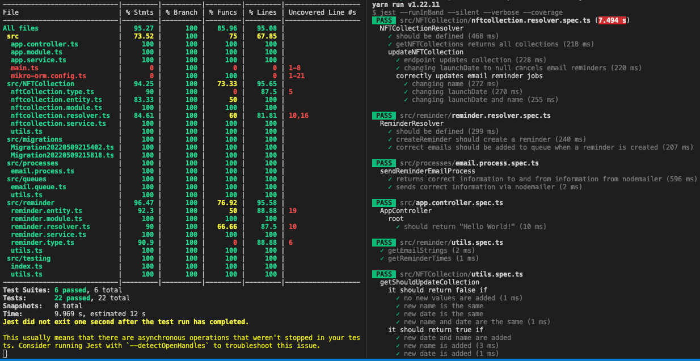

<p align="center">
  <a href="http://nestjs.com/" target="blank"></a>
</p>

[circleci-image]: https://img.shields.io/circleci/build/github/nestjs/nest/master?token=abc123def456
[circleci-url]: https://circleci.com/gh/nestjs/nest

  <p align="center">A Nest.js application for sending NFT Collection launch reminder emails.</p>
    <p align="center">
<a href="https://coveralls.io/github/nestjs/nest?branch=master" target="_blank"></a>
</p>

## Description

Based on the [Nest](https://github.com/nestjs/nest) framework TypeScript starter repository.

Never forget your next NFT Collection launch again! Get emailed reminders just in time 😀  🎉  🎊  🍻  🎁

## Notes

I have added some thoughts here on different decisions I made when building this system.

## Testing

I decided to create a test PostgreSQL database for testing purposes.

I didn't add a test database for Redis just to save time, so the tests and the app use the same redis store.

I wrote most of the tests as either unit tests for specific important functionality and integration tests at the level of the resolver.

I didn't write any tests at the e2e level, which is something I would do if I was going to invest more time into this.

I still managed to achieve `95%` test coverage across the application, and almost all the most important core functionality is well tested.



### Queue System

The next main design decision I made was to use [BULL](https://optimalbits.github.io/bull/) with Redis to handle the email reminder queue.

Using Redis allows jobs to be persisted in the case of a server restart, and bull has a pretty nice api for handling queues and processes.

I chose to use `bulkAdd` when adding reminders for a particular email, though I am not sure this efficiency benefit is really needed, and it comes at a risk as BULL handles failures by cancelling all jobs within a single `bulkAdd` operation.

I didn't add any failure protection for this scenario.

For this reason I decided not to `bulkAdd` to update all reminders at once when updating a collection launch date or name.

Instead the reminder jobs are chunked at the level of per email. This way if there was a failure, it would just be for a single user.

### Object Relational Mapping

I decided to use [MikroORM](https://mikro-orm.io/) for an ORM as they have a nice [integration with Nest.js](https://docs.nestjs.com/recipes/mikroorm) and a cool feature where the GraphQL schema can be inferred from the MikroORM Entitys, so you don't have to write it out explicitly.

You can also see [details on the integration from MikroORM's docs here](https://mikro-orm.io/docs/usage-with-nestjs).

[TypeORM](https://typeorm.io/) is much more popular, but I wanted to try out the alternative.

### Schema

I decided to go for two simple entities:

Table of emails (Reminder):
- id: ID
- email: String
- collection: ID


Table of collections (NFTCollection):
- id: ID
- name: String
- launchDate: Date | null

They both also have a `createdAt` and `updatedAt` date.

## Installation and Quick Start

1. Install all the dependencies:
```bash
$ npm install
```
2. Boot docker instances for databases:
```bash
docker run --name fair-xyz --publish 5432:5432 -e POSTGRES_PASSWORD=postgres -d postgres
docker run --name redis-fair-xyz -d -p 6379:6379 redis:6.0
docker container ls # to check the dbs have been setup
```

3. Create two databases within `fair-xy`:
     - `fair-xyz`
     - `fair-xyz-test` (this is a test db, it is only needed for running the tests)

4. Now you have the databases up, you can run the migrations
```
npx mikro-orm migration:up
```
5. Now you are ready to go!
```bash
npm run start:dev
```

## Running the app

```bash
# development
$ npm run start

# watch mode
$ npm run start:dev

# production mode
$ npm run start:prod
```

## Test

```bash
# unit tests
$ npm run test

# e2e tests
$ npm run test:e2e

# test coverage
$ npm run test:cov
```

## Setting up the DBs from pgAdmin


1. Open up pgAdmin.
2. Created a new server:
```
General => Name: fair-xyz
Connection => Host name/address: localhost. Port => 5432. Password: postgres. Save password => true.
```

3. Create the databases:

- The database section shouldis here: Servers -> fair-xyz -> Databases -> postgres;
- Next I created a db using the GUI:
   - Right click Databases -> Create -> Database: fair-xyz -> Save.
   - Right click Databases -> Create -> Database: fair-xyz-test -> Save.


4. Run the migrations if you haven't already:
```
npx mikro-orm migration:up
```

- Should now be able to see in pgAdmin: fair-xyz => Databases => fair-xyz => Schemas => Tables => student => Columns (6)
- Now you can boot the server and execute a query or mutation at `http://localhost:3000/graphql`

## Queries

```graphql
query {
  getNFTCollections {
    uuid
    name
    launchDate
  }
}
```

## Mutations:

```graphql
mutation {
  updateNFTCollection(uuid: "112f7f68-a519-445d-beaf-52e21a2d5f6d", launchDate: "2022-05-14 22:11:44+00") {
    uuid
    name
    launchDate
  }
}
```

```graphql
mutation {
  createReminder(email: "example@gmail.com", collection: "f8f454c9-531b-4984-971d-a432a5991cc9") {
    uuid
    email
    collection {
      uuid
      name
      launchDate
    }
  }
}
```

## Quick Start - If already installed and setup before

```
docker start fair-xyz
docker start redis-fair-xyz
npm run start:dev
```

## Stay in touch

- Author - [Tom Harper](https://github.com/tommyrharper)
